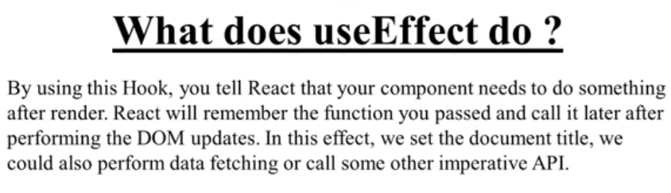
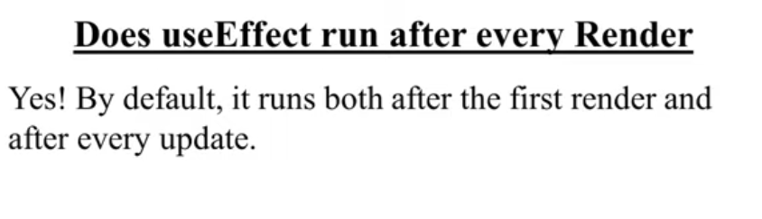

# day1

# Introduction
React Js Is a Javascript LIbrary for building frontend application or UI
The main reason to use it is it's reusable ui components


## Advantages of ReactJS
- Reusable Components 
- Open source
- Efficient and Fast
- Works in Browser
- Vast Community

# How ReactJs works
- Creates a Virtual Dom
- This Guy checks all the time what has changed with it's past self with the present code and change only them
- So the other things don't change 
- So the application acts as a single page application(working without reloading)
-  

# day2

# React Requirements:-
- NPM:- It is a js packagemanager. It is used to take advantages of third party packages and easily install or update them.
- Webpack:- It is a static moule bundler for modern js application. When webpack processes the application , it  internally builds a dependency graph which maps every modelue the project needs and generates one or more bundles
- Babel - It's a toolchain that is mainly used to convert ecmascript code into backward compatible versiob of js in currecnt and older browsers.

---

# How to create react application without using babel webpack,cdn links and jsx
- React.createElement(type,props,children)
  - type-> type of html element or component 
  - props -> properties of the object
  - children -> anything need to be put between the dom elements
- render() -> It is the only required method in a class component . It examines this.props and this.state .  it returns one of the following types:
  - React elements -> these are created via jsx
  - array and fragments -> React can't return multiple elements together so they use arrays.
- ReactDOM.render(element,DOMnode)->
  - element:- which element u want to render
  - DOMnode:- where u want to render
  - 

# React directory structure 


> Public folder's content doesn't get bundled , They are just copied while making stuff

# day3

# Create First app
- ```npx create-next-app@latest```  >I have no clue
- ```npm create vite@latest```
# render method, createElement method and ReactDom render method


# Fragments
it is used to group a list of children without adding extra nodes to the dom
- <></>
- <React.Fragment></React.Fragment>

# Components


# day4

# Compose Components in ReactJS
- Did last day
# differece between functional and class Component
- Use functional components if we are writting a presentational component which doesn't have it's own state or needs to access a lifecycle hook. You cannot use setState() in your component because FUnctional Components are pure Javascript function.

    >**Note**:- After 16.8 update it has useState and UseEffect and other hhoks to manage state and lifecycle logic
- Class Components
    Definition: ES6 classes that extend React.Component and must have a render() method returning JSX.

    State: Can use this.state and this.setState() to manage state.

    Lifecycle Methods: Support built-in lifecycle methods like componentDidMount(), componentDidUpdate(), etc.

# JSX
JSX stands for JavaScript XML. It is a extension to JavaScript. Jsx is a preprocessor step that XML syntax

It produces React Element
It is easier to understand
in {} we have to use them for writting js directly!
[alt text](image.png)


# Props
- It is the jsx attributes
- >**Note** -> Each element name should be in capital Letter
-  In class based components we have to use this.props.<propsname> to acess them

# PropType
- It is used to make sure the type of the properties
    - At first Installation
        ```cmd
        npm install --save prop-types
        ```
    - then
        ```Javascript
        import PropTypes from 'prop-types';
        Student.propTypes ={
            name: PropTypes.string
        }

        Student.propTypes ={
            name: PropTypes.string.isRequired // It is for is required logic means u can't pass null
        }
        Student.defaultProps ={
            name: "<default value>"
        }
        ```


# day5

## ✅ Children in JSX

* In **JSX**, any content placed between an opening and closing tag is passed to the component as a special prop called `props.children`.

  * Example:

    ```jsx
    <Student>Hello, I’m a child!</Student>
    ```

---

### ✅ Functional Component Example

```javascript
import React from "react";

const Student = (props) => {
  return <div>{props.children}</div>;
};

export default Student;
```

---

### ✅ Class Component Example

```javascript
import React, { Component } from "react";

class Student extends Component {
  render() {
    return <div>{this.props.children}</div>;
  }
}

export default Student;
```

---

## ✅ State in React

**State** is used to manage dynamic data in a component. It is **private** to the component and determines how the component renders and behaves.

---

### ❌ Outdated Statement:

> ~~We can create state only in class components.~~
> ✅ **Correct:** With the introduction of **Hooks**, we can now create state in **functional components** as well.

---

### ✅ 3 Ways to Declare State

---

### 1️⃣ Functional Component with `useState` (Modern – Recommended)

```javascript
import React, { useState } from "react";

const Student = (props) => {
  const [name, setName] = useState("Rahul");
  const [roll, setRoll] = useState(props.roll);

  return (
    <div>
      {name} - {roll}
    </div>
  );
};

export default Student;
```

---

### 2️⃣ Class Component – Directly Inside Class (Old but Valid)

```javascript
import React, { Component } from "react";

class Student extends Component {
  state = {
    name: "Rahul",
    roll: this.props.roll,
  };

  render() {
    return (
      <div>
        {this.state.name} - {this.state.roll}
      </div>
    );
  }
}

export default Student;
```

---

### 3️⃣ Class Component – Inside Constructor (Older Style)

```javascript
import React, { Component } from "react";

class Student extends Component {
  constructor(props) {
    super(props);
    this.state = {
      name: "Rahul",
      roll: this.props.roll,
    };
  }

  render() {
    return (
      <div>
        {this.state.name} - {this.state.roll}
      </div>
    );
  }
}

export default Student;
```


## Event Handling
The actions to which JavaScript can respond are called Events.


> now this works kinda different in js . it behaves differently depending on the situations. 
> **If in interview they ask to implement this without implementing it using arrow function**  

---

- ✅ Mouse Events

    | Event           | Description                              |
    | --------------- | ---------------------------------------- |
    | `onClick`       | User clicks on an element                |
    | `onDoubleClick` | User double-clicks on an element         |
    | `onMouseDown`   | Mouse button is pressed                  |
    | `onMouseUp`     | Mouse button is released                 |
    | `onMouseEnter`  | Cursor enters an element (no bubbling)   |
    | `onMouseLeave`  | Cursor leaves an element (no bubbling)   |
    | `onMouseMove`   | Mouse is moved over an element           |
    | `onMouseOver`   | Mouse is over an element or its children |
    | `onMouseOut`    | Mouse leaves an element or its children  |


- ✅ Keyboard Events

    | Event        | Description                                  |
    | ------------ | -------------------------------------------- |
    | `onKeyDown`  | Key is pressed down                          |
    | `onKeyPress` | Key is pressed (deprecated, use `onKeyDown`) |
    | `onKeyUp`    | Key is released                              |

- ✅ Form Events

    | Event       | Description                            |
    | ----------- | -------------------------------------- |
    | `onChange`  | Value of input/textarea/select changes |
    | `onInput`   | User input in text field               |
    | `onSubmit`  | Form submission                        |
    | `onReset`   | Form reset                             |
    | `onInvalid` | Form field validation fails            |
    | `onSelect`  | Text is selected in input/textarea     |

- ✅ Focus Events

    | Event     | Description            |
    | --------- | ---------------------- |
    | `onFocus` | Element receives focus |
    | `onBlur`  | Element loses focus    |


- ✅ Clipboard Events

    | Event     | Description               |
    | --------- | ------------------------- |
    | `onCopy`  | Copy operation triggered  |
    | `onCut`   | Cut operation triggered   |
    | `onPaste` | Paste operation triggered |

- ✅ Composition Events

    | Event                 | Description              |
    | --------------------- | ------------------------ |
    | `onCompositionStart`  | Composition starts (IME) |
    | `onCompositionUpdate` | During composition       |
    | `onCompositionEnd`    | Composition ends         |

- ✅ Touch Events (Mobile)

    | Event           | Description               |
    | --------------- | ------------------------- |
    | `onTouchStart`  | Finger touches the screen |
    | `onTouchMove`   | Finger moves on screen    |
    | `onTouchEnd`    | Finger lifted from screen |
    | `onTouchCancel` | Touch event interrupted   |

- ✅ Pointer Events

    | Event             | Description                      |
    | ----------------- | -------------------------------- |
    | `onPointerDown`   | Pointer is pressed down          |
    | `onPointerMove`   | Pointer is moved                 |
    | `onPointerUp`     | Pointer is released              |
    | `onPointerCancel` | Pointer is canceled              |
    | `onPointerEnter`  | Pointer enters element           |
    | `onPointerLeave`  | Pointer leaves element           |
    | `onPointerOver`   | Pointer is over element or child |
    | `onPointerOut`    | Pointer leaves element or child  |

- ✅ UI Events

    | Event      | Description         |
    | ---------- | ------------------- |
    | `onScroll` | Element is scrolled |

- ✅ Wheel Events

    | Event     | Description                  |
    | --------- | ---------------------------- |
    | `onWheel` | Mouse wheel or trackpad used |

- ✅ Media Events

    | Event              | Description                         |
    | ------------------ | ----------------------------------- |
    | `onAbort`          | Media load aborted                  |
    | `onCanPlay`        | Media can start playing             |
    | `onCanPlayThrough` | Media can play through              |
    | `onDurationChange` | Duration metadata loaded            |
    | `onEmptied`        | Media becomes empty                 |
    | `onEncrypted`      | Encrypted media encountered         |
    | `onEnded`          | Playback reaches end                |
    | `onLoadedData`     | Media data loaded                   |
    | `onLoadedMetadata` | Metadata (duration, etc.) loaded    |
    | `onLoadStart`      | Media loading started               |
    | `onPause`          | Media is paused                     |
    | `onPlay`           | Media is starting to play           |
    | `onPlaying`        | Media is playing                    |
    | `onProgress`       | Media is downloading                |
    | `onRateChange`     | Playback rate changed               |
    | `onSeeked`         | Seek operation completed            |
    | `onSeeking`        | Seeking in progress                 |
    | `onStalled`        | Fetching media is stalled           |
    | `onSuspend`        | Media fetch suspended               |
    | `onTimeUpdate`     | Time indicated by the `currentTime` |
    | `onVolumeChange`   | Volume changed                      |
    | `onWaiting`        | Playback is waiting for more data   |

- ✅ Image Events

    | Event     | Description                  |
    | --------- | ---------------------------- |
    | `onLoad`  | Image or iframe is loaded    |
    | `onError` | Error occurred while loading |

- ✅ Animation Events

    | Event                  | Description           |
    | ---------------------- | --------------------- |
    | `onAnimationStart`     | CSS animation starts  |
    | `onAnimationEnd`       | CSS animation ends    |
    | `onAnimationIteration` | CSS animation repeats |

- ✅ Transition Events

    | Event             | Description              |
    | ----------------- | ------------------------ |
    | `onTransitionEnd` | CSS transition completes |

- ✅ Drag Events

    | Event         | Description                |
    | ------------- | -------------------------- |
    | `onDrag`      | Element is being dragged   |
    | `onDragStart` | Dragging starts            |
    | `onDragEnd`   | Dragging ends              |
    | `onDragEnter` | Draggable enters a target  |
    | `onDragLeave` | Draggable leaves a target  |
    | `onDragOver`  | Draggable is over a target |
    | `onDrop`      | Dropped on a target        |

---

## setState

In React, setState is a method used to update the state of a component. It triggers a re-render with the new state.

```javascript
class Counter extends React.Component {
  constructor(props) {
    super(props);
    this.state = { count: 0 };
  }

  increment = () => {
    this.setState({ count: this.state.count + 1 });
  };

  render() {
    return <button onClick={this.increment}>Count: {this.state.count}</button>;
  }
}
```

- Asynchronous: setState doesn’t update the state immediately.

- Batched Updates: React may combine multiple setState calls for performance.

- Function Form (when new state depends on previous state):

```jsx
this.setState((prevState) => ({ count: prevState.count + 1 }));
```

## Passing Arguments to Event handlers in ReactJS


> inplace of the extra function we can pass it as arroow function inside the jsx/tsx itself

there's also another way
```js
<button onClick={this.handleClick.bind(this, id)}>Delete</button>
```


# day6

# Life Cycle of Components in React
In React, components go through a lifecycle of events from creation to destruction. Understanding these lifecycle methods is crucial for managing side effects, optimizing performance, and ensuring that your components behave as expected.
they are divided into three main phases:
1. **Mounting**: When an instance of a component is being created and inserted into the DOM.
2. **Updating**: When a component is being re-rendered as a result of changes to either its props or state.
3. **Unmounting**: When a component is being removed from the DOM.
4. **Error Handling**: When an error occurs during rendering, in a lifecycle method, or in the constructor of any child component.
# mounting:-
- Mounting is the process of creating an element and inserting it in a DOM tree

Following methgods are called in the following order when an instance of a component is being created and inserted into the DOM
- **constructor**
- static getDerivedStateFromProps
- **render**
- **componentDidMount**


## Constructor
The constructor is called before a React component is called before it is mounted.
When implementing the constructor for a React.Component subclass , you should call super(props) before any other statement. Otherwise, this.props will be undefined in the constructor, which can lead to bugs.

React Constructors are used only for 2 purpose
- Initializing local state by assiginig an object to this.state
- binding event handler methods to an instance.


## getDerivedStateFromProps
getDerivedStateFromProps is invoked right before calling the render method, both on the initial mount and on subsequent updates. It should return an object to update state, or null to update nothing. Yhis method exists for rare use cases where the state depends on changes in props over time. It is a static method, so it does not have access to this.

```javascript
static getDerivedStateFromProps(props, state) {
  // Return an object to update state, or null to update nothing.
  return null;
}
```
## Render
The render() method is the only required method in a class component. It examines this.props and this.state.
It returns one of the following types:
- React elements - These are created via JSX(Not required).
For example, <div /> and <App/> are React elements that instruct React to render a DOM node, or another user-defined component, respectively.
- Arrays and fragments It is used to return multiple elements from render.
- Portals It is used to render children into a different DOM subtree.
- String and numbers - These are rendered as text nodes in the DOM.
- Booleans or null It renders nothing. (Mostly exists to support return test && <Child pattern, where test is boolean.)
> Note The render() function should be pure, meaning that it does not modify component state, it returns the same result each time it's invoked, and it does not directly interact with the browser.

## componentDidMount
componentDidMount is invoked immediately after a component is mounted. This method is executed once, only on the client side, and is a good place to initiate network requests, set up subscriptions, or perform any setup that requires DOM nodes.
```javascript
componentDidMount() {
  // Perform setup that requires DOM nodes or network requests.
}
```


# Updating:-
Updating is the process of changing state or props of an element in a DOM tree.

An update can be caused by changes to either the component's props or state. The following methods are called in the following order when a component is being re-rendered as a result of changes to either its props or state:
- static getDerivedStateFromProps
- shouldComponentUpdate
- **render**
- getSnapshotBeforeUpdate
- **componentDidUpdate**

### getDerivedStateFromProps
This method is invoked right before calling the render method, both on the initial mount and on subsequent updates. It should return an object to update state, or null to update nothing. This method exists for rare use cases where the state depends on changes in props over time. It is a static method, so it does not have access to `this`.

```javascript
static getDerivedStateFromProps(props, state) {
  // Return an object to update state, or null to update nothing.
  return null;
}
```
Let's say we have 2 components, `Parent` and `Child`, where `Child` receives props from `Parent`. If `Parent` updates its state, `Child` will re-render. If you want to update the state of `Child` based on the new props it receives, you can use `getDerivedStateFromProps`.

```javascript
class Parent extends React.Component {
    constructor(props) {
        super(props);
        this.state = { value: 0 };
    }
    increment = () => {
        this.setState({ value: this.state.value + 1 });
    };
    render() {
        return (
            <div>
                <Child value={this.state.value} />
                <button onClick={this.increment}>Increment</button>
            </div>
        );
}
```
```javascript
class Child extends React.Component {
    constructor(props) {
        super(props);
        this.state = { derivedValue: 0 };
    }
    static getDerivedStateFromProps(Props, State) {
        // Update derivedValue based on the new props
        if (Props.value !== State.derivedValue) {
            return { derivedValue: Props.value };
        }
        return null; // No state update needed
    }
    render() {
        return <div>Derived Value: {this.state.derivedValue}</div>;
    }
}
```
### shouldComponentUpdate
shouldComponentUpdate is invoked before rendering when new props or state are received. It allows you to control whether a component should re-render or not. If it returns false, the component will not re-render. This method is useful for optimizing performance by preventing unnecessary renders.
```javascript
shouldComponentUpdate(nextProps, nextState) {
  // Return true to allow re-render, false to prevent it.
  return true; // or false based on your logic
}
```
For example, if you have a component that receives props frequently but doesn't need to update its UI, you can use shouldComponentUpdate to prevent unnecessary re-renders.
```javascript
class MyComponent extends React.Component {
    shouldComponentUpdate(nextProps, nextState) {
        // Prevent re-render if props haven't changed
        return nextProps.value !== this.props.value;
    }
    render() {
        return <div>{this.props.value}</div>;
    }
}
```
### getSnapshotBeforeUpdate
This method is invoked right before the most recently rendered output is committed to the DOM. It allows you to capture some information (snapshot) from the DOM before it changes. The value returned by this method is passed as a third parameter to componentDidUpdate.
```javascript
getSnapshotBeforeUpdate(prevProps, prevState) {
  // Capture some information from the DOM before it changes.
  return null; // or some value to be used in componentDidUpdate
}
```
For example, if you want to capture the scroll position of a list before it updates, you can use getSnapshotBeforeUpdate:
```javascript
class ListComponent extends React.Component {
    getSnapshotBeforeUpdate(prevProps, prevState) {
        // Capture the scroll position before the update
        const list = this.listRef.current;
        return list.scrollTop; // Return the scroll position
    }
    componentDidUpdate(prevProps, prevState, snapshot) {
        // Use the snapshot to restore the scroll position after the update
        const list = this.listRef.current;
        if (snapshot !== null) {
            list.scrollTop = snapshot; // Restore the scroll position
        }
    }
    render() {
        return (
            <div ref={this.listRef}>
                {/* Render list items here */}
            </div>
        );
    }
}
```
### componentDidUpdate
componentDidUpdate is invoked immediately after updating occurs. This method is not called for the initial render. It is a good place to perform side effects, such as network requests or DOM manipulations, based on the updated props or state. It receives three parameters: prevProps, prevState, and snapshot (if getSnapshotBeforeUpdate is used).
It will not get called if shouldComponentUpdate returns false.
```javascript
componentDidUpdate(prevProps, prevState, snapshot) {
  // Perform side effects based on the updated props or state.
  // prevProps and prevState are the previous values before the update.
  // snapshot is the value returned by getSnapshotBeforeUpdate, if used.
}
```
For example, if you want to fetch new data based on updated props, you can use componentDidUpdate:
```javascript
class DataFetcher extends React.Component {
    componentDidUpdate(prevProps) {
        // Fetch new data if the props have changed
        if (prevProps.id !== this.props.id) {
            this.fetchData(this.props.id);
        }
    }
    fetchData(id) {
        // Fetch data based on the provided id
        fetch(`/api/data/${id}`)
            .then(response => response.json())
            .then(data => {
                this.setState({ data });
            });
    }
    render() {
        return (
            <div>
                {/* Render fetched data here */}
            </div>
        );
    }
}
```
---


# Life Cycle Diagram

```markdown
+-------------------------------+
|   getDerivedStateFromProps() |
+-------------------------------+
              ↓
+-------------------------------+
|    shouldComponentUpdate()   |
+-------------------------------+
     ↓ Yes           ↓ No
  +--------+        Skip Render
  | render |
  +--------+
      ↓
+-------------------------------+
| getSnapshotBeforeUpdate()    |
+-------------------------------+
              ↓
+-------------------------------+
|   componentDidUpdate()       |
+-------------------------------+
```

# Unmounting:-
Unmounting is the process of removing a component from the DOM. The following method is called when a component is being removed from the DOM:
- **componentWillUnmount**
### componentWillUnmount
componentWillUnmount is invoked immediately before a component is unmounted and destroyed. This method is used to perform any necessary cleanup, such as cancelling network requests, removing event listeners, or cleaning up timers.
```javascript
componentWillUnmount() {
  // Perform cleanup before the component is removed from the DOM.
}
```
For example, if you have a component that sets up a timer, you can use componentWillUnmount to clear the timer when the component is about to be removed:
```javascript
class TimerComponent extends React.Component {
    componentDidMount() {
        this.timer = setInterval(() => {
            this.setState({ time: new Date() });
        }, 1000);
    }
    componentWillUnmount() {    
        clearInterval(this.timer); // Clear the timer when the component is unmounted
    }
    render() {
        return <div>Current Time: {this.state.time.toLocaleTimeString()}</div>;
    }
}
```


# Hooks

Hooks are functions that let you use state and other React features without writing a class. They allow you to manage component lifecycle, state, and side effects in functional components.

when to use hooks:
- When you want to use state in a functional component.

Rules of Hooks:
- Only call hooks at the top level of your React function. Don't call hooks inside loops, conditions, or nested functions.
- Only call hooks from React function components or custom hooks. Don't call hooks from regular JavaScript functions.
- React relies on the order of hooks calls to maintain state consistency. If you change the order of hooks, it can lead to bugs.
- Hooks don't work inside class components. They are designed for functional components only.


## UseState
useState is a Hook that lets you add state to your functional components. we call it inside a functional component to declare a state variable and a function to update it.
Usestate returns an array with two elements: the current state value and a function to update that state value.

```javascript
import React, { useState } from 'react';
function Counter() {
  // Declare a state variable called count, initialized to 0
  const [count, setCount] = useState(0);
  muhehehe = () => {
    // Update the count state when the button is clicked
    setCount(count + 1);
  };
  return (
    <div>
      <p>You clicked {count} times</p>
      {/* Update the count state when the button is clicked */}
      <button onClick={muhehehe}>
        Click me
      </button>
    </div>
  );
}
```


## UseEffect
useEffect is a Hook that lets you perform side effects in your functional components. It is called after the component renders and can be used for tasks like data fetching, subscriptions, or manually changing the DOM.
useEffect takes two arguments: a function that contains the side effect logic and an optional dependency array that determines when the effect should run. If the dependency array is empty, the effect runs only once after the initial render. If it contains variables, the effect runs whenever those variables change.
Basically it is used to replace the componentDidMount, componentDidUpdate, and componentWillUnmount lifecycle methods in class components.

```javascript
import React, { useState, useEffect } from 'react';
function ExampleComponent() {
  const [count, setCount] = useState(0);
    useEffect(() => {
        // This effect runs after every render
        document.title = `You clicked ${count} times`;
        
        // Cleanup function (optional)
        return () => {
        console.log('Cleanup before the next effect or unmount');
        };
    }, [count]); // The effect depends on the count variable
    return (
        <div>
            <p>You clicked {count} times</p>
            <button onClick={() => setCount(count + 1)}>
                Click me
            </button>
        </div>
    );
}
```





It also takes an array of dependencies as the second argument. If any of the dependencies change, the effect will run again. If you pass an empty array, the effect will only run once after the initial render, similar to componentDidMount.

```javascript
useEffect(() => {
  // This effect runs only once after the initial render
  console.log('Component mounted');
}, []); // Empty dependency array
```


## Custom Hooks
A custom Hook is a JavaScript function, when we want to share logic between components, we can create a custom Hook. Custom Hooks allow you to extract component logic into reusable functions.
> Example of a custom Hook that manages a counter:


# day7

# Conditional Rendering in React


**IIFE (Immediately Invoked Function Expression)**

```jsx
const MyComponent = ({ user }) => {
  return (
    <div>
      {
        (() => {
          if (user.isAdmin) {
            return <p>Welcome, Admin!</p>;
          } else {
            return <p>Welcome, User!</p>;
          }
        })()
      }
    </div>
  );
};
export default MyComponent;
```

# Lists in React


```jsx
const MyList = ({ items }) => {
  return (
    <ul>
      {items.map((item, index) => (
        <li key={index}>{item}</li>
      ))}
    </ul>
  );
};
export default MyList;
```

# keys in Lists


# Inline Styles in React

```jsx
const MyComponent = () => {
  const divStyle = {
    color: 'blue',
    backgroundColor: 'lightgray',
    padding: '10px',
    borderRadius: '5px',
  };

  return <div style={divStyle}>Hello, Inline Styles!</div>;
};
export default MyComponent;
```
>To apply both class


# External CSS in React


```jsx
import './styles.css';
const MyComponent = () => {
  return <div className="my-class">Hello, External CSS!</div>;
};
export default MyComponent;
```
```css
.my-class {
  color: green;
  background-color: lightyellow;
  padding: 10px;
  border-radius: 5px;
}
```
> External CSS is global and can affect all components that use the same class names. To avoid conflicts, consider using CSS Modules or styled-components for scoped styles.

