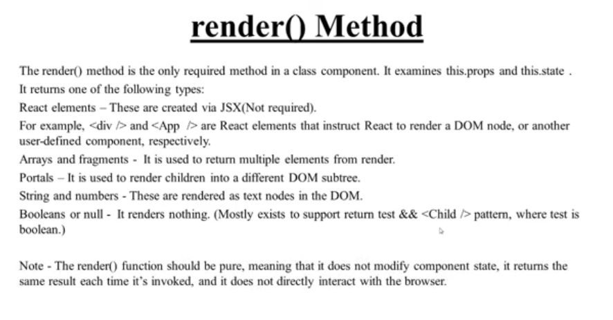
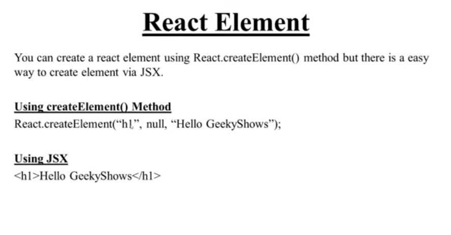
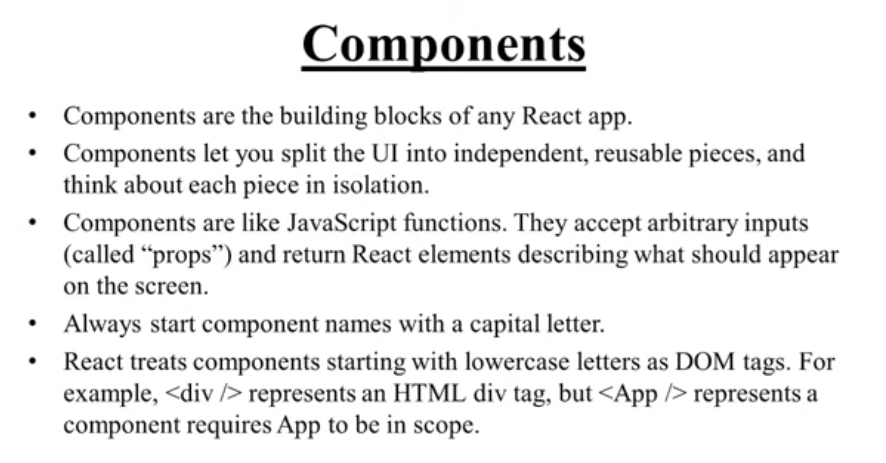

# Create First app
- ```npx create-next-app@latest```  >I have no clue
- ```npm create vite@latest```
# render method, createElement method and ReactDom render method




# Fragments
it is used to group a list of children without adding extra nodes to the dom
- <></>
- <React.Fragment></React.Fragment>

# Components

