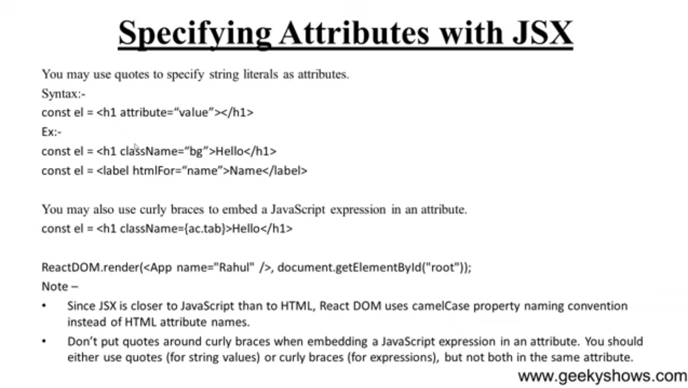

# Compose Components in ReactJS
- Did last day
# differece between functional and class Component
- Use functional components if we are writting a presentational component which doesn't have it's own state or needs to access a lifecycle hook. You cannot use setState() in your component because FUnctional Components are pure Javascript function.

    >**Note**:- After 16.8 update it has useState and UseEffect and other hhoks to manage state and lifecycle logic
- Class Components
    Definition: ES6 classes that extend React.Component and must have a render() method returning JSX.

    State: Can use this.state and this.setState() to manage state.

    Lifecycle Methods: Support built-in lifecycle methods like componentDidMount(), componentDidUpdate(), etc.

# JSX
JSX stands for JavaScript XML. It is a extension to JavaScript. Jsx is a preprocessor step that XML syntax

It produces React Element
It is easier to understand
in {} we have to use them for writting js directly!
[alt text](image.png)



# Props
- It is the jsx attributes
- >**Note** -> Each element name should be in capital Letter
-  In class based components we have to use this.props.<propsname> to acess them

# PropType
- It is used to make sure the type of the properties
    - At first Installation
        ```cmd
        npm install --save prop-types
        ```
    - then
        ```Javascript
        import PropTypes from 'prop-types';
        Student.propTypes ={
            name: PropTypes.string
        }

        Student.propTypes ={
            name: PropTypes.string.isRequired // It is for is required logic means u can't pass null
        }
        Student.defaultProps ={
            name: "<default value>"
        }
        ```


