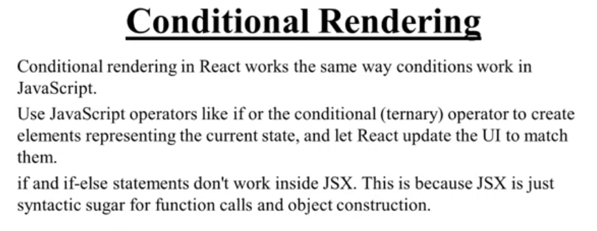
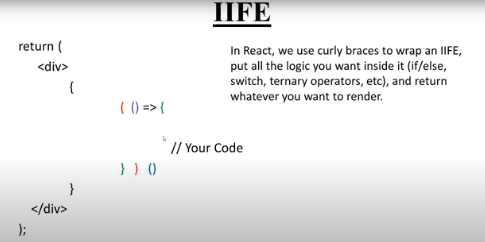

# Conditional Rendering in React





**IIFE (Immediately Invoked Function Expression)**

```jsx
const MyComponent = ({ user }) => {
  return (
    <div>
      {
        (() => {
          if (user.isAdmin) {
            return <p>Welcome, Admin!</p>;
          } else {
            return <p>Welcome, User!</p>;
          }
        })()
      }
    </div>
  );
};
export default MyComponent;
```

# Lists in React


```jsx
const MyList = ({ items }) => {
  return (
    <ul>
      {items.map((item, index) => (
        <li key={index}>{item}</li>
      ))}
    </ul>
  );
};
export default MyList;
```

# keys in Lists


# Inline Styles in React

```jsx
const MyComponent = () => {
  const divStyle = {
    color: 'blue',
    backgroundColor: 'lightgray',
    padding: '10px',
    borderRadius: '5px',
  };

  return <div style={divStyle}>Hello, Inline Styles!</div>;
};
export default MyComponent;
```
>To apply both class


# External CSS in React


```jsx
import './styles.css';
const MyComponent = () => {
  return <div className="my-class">Hello, External CSS!</div>;
};
export default MyComponent;
```
```css
.my-class {
  color: green;
  background-color: lightyellow;
  padding: 10px;
  border-radius: 5px;
}
```
> External CSS is global and can affect all components that use the same class names. To avoid conflicts, consider using CSS Modules or styled-components for scoped styles.