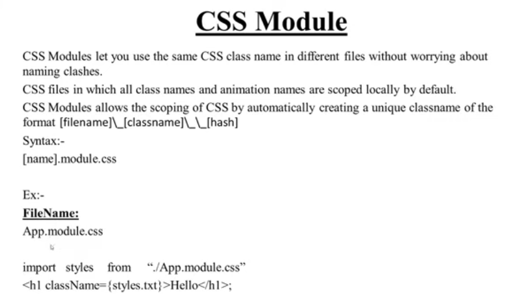
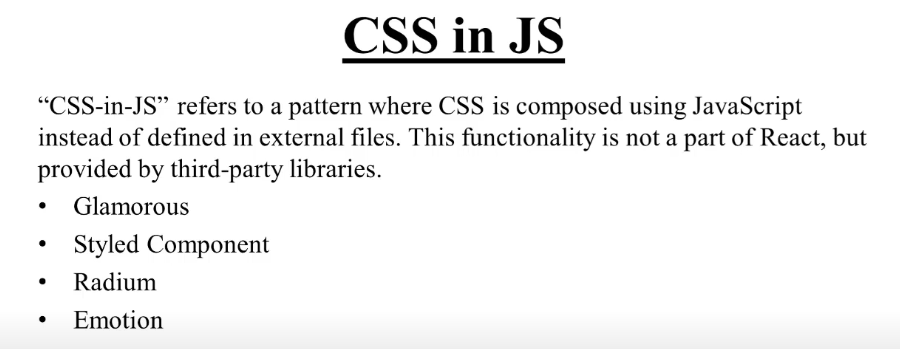
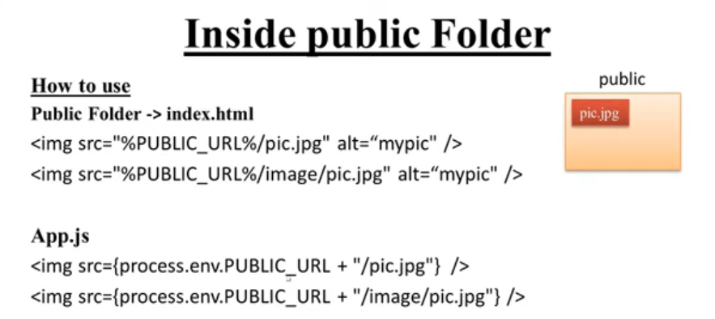
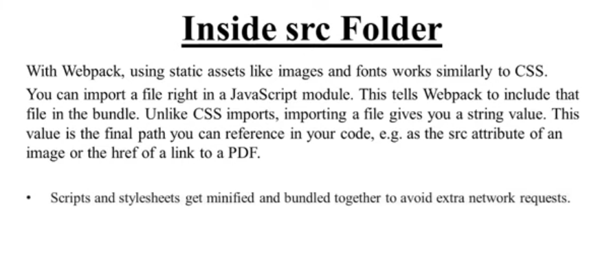
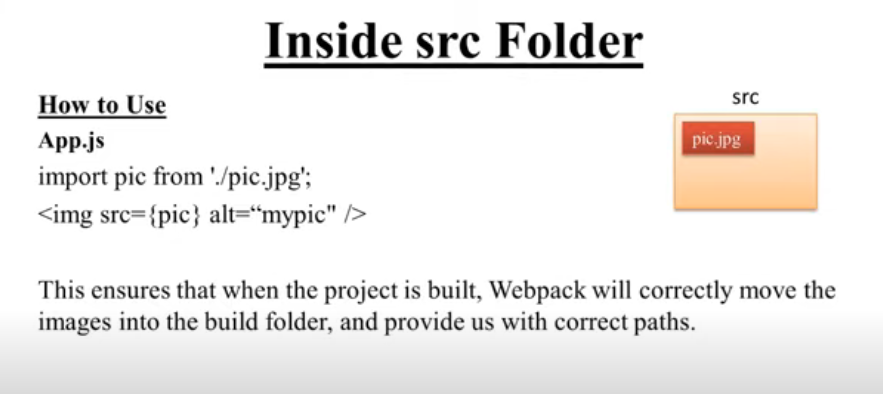
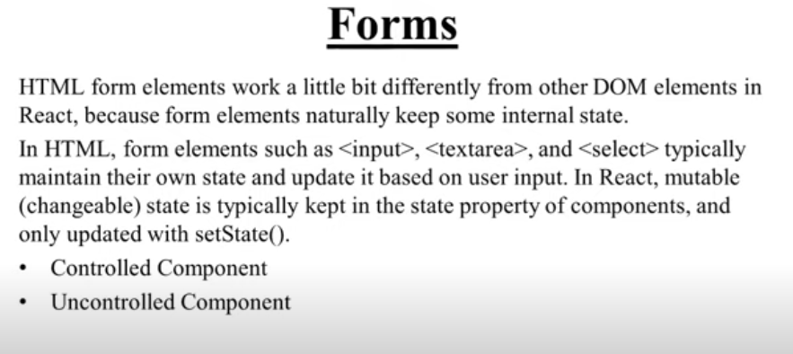

# CSS Module
This is a simple CSS module that can be used to style your web applications. It includes basic styles for layout, typography, and buttons. It let's us define styles in a modular way, avoiding conflicts with other styles in the application.

 
```css
/* app.module.css */
.container {
  display: flex;
  flex-direction: column;
  align-items: center;
  padding: 20px;
}
.title {
  font-size: 2rem;
  color: #333;
}
.button {
  padding: 10px 20px;
  background-color: #007bff;
  color: white;
  border: none;
  border-radius: 5px;
  cursor: pointer;
}
```
```jsx
import React from 'react';
import styles from './app.module.css';

const App = () => {
  return (
    <div className={styles.container}>
      <h1 className={styles.title}>Welcome to My App</h1>
      <button className={styles.button}>Click Me</button>
    </div>
  );
};

export default App;
```
# CSS in JS
This is a simple CSS-in-JS example using styled-components. It allows you to write CSS directly within your JavaScript files, making it easier to manage styles that are scoped to components.


# Images and assets in React



## Public Folder
For running in HTML:-
```html
<!DOCTYPE html>
<html lang="en">
<head>
    <meta charset="UTF-8">
    <meta name="viewport" content="width=device-width, initial-scale=1.0">
    <title>CSS Module Example</title>
    <link rel="stylesheet" href="app.module.css">
</head>
<body>
    <div id="root"></div>
    
    <script src="app.js"></script>
</body>
</html>
```
 For running in React:-
```jsx
import React from 'react';
export default function App() {
  return (
    <div>
      <h1>CSS Module Example</h1>
      
    </div>
  );
}
```
## src Folder



# Form



