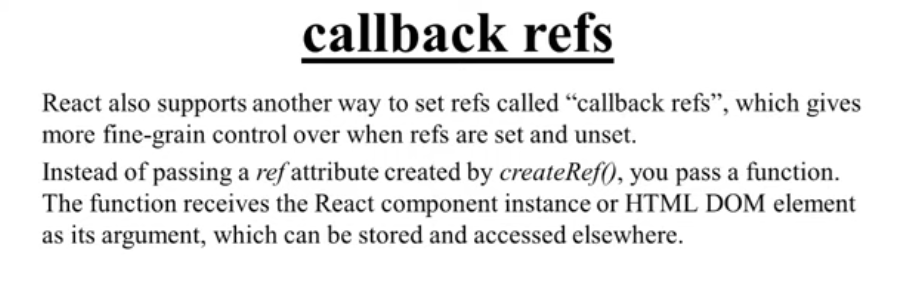

# Controlled Compositions in React
So in React, we often use controlled components to manage form inputs. This means that the component's state is controlled by React, and the input value is set via props.

In case of a controlled input, the value of the input is set by the state of the component, and any changes to the input are handled by an event handler that updates the state.

Suppose we have a html input element with a value set by the component's state:
```html
<input type="text" value="Hell no" />
```
and a react input component :-
```jsx
import React from 'react';

export default function ControlledInput() {
 return (
    <input type="text" value="hell no" />
  );
}
```

We will see that the input value is set to "hell no" when the component renders. However, if we try to change the input value by typing in it, nothing will happen because the input is controlled by React and does not have an `onChange` handler to update the state. but The html input element will not throw an error. 

Now the solution is either to add an `onChange` handler to the input element or `defaultValue`

For the onChange handler, we can do something like this:
```jsx
import React, { useState } from 'react';

export default function ControlledInput() {
 const [inputValue, setInputValue] = useState('');

 const handleChange = (e) => {
   setInputValue(e.target.value.toUpperCase());
 };
 return (
   <input
     type="text"
     value={inputValue}
     onChange={handleChange}
   />
 );
}
```
# Managing multiple inputs
When dealing with multiple inputs, we can use a single state object to manage all input values.
```jsx
import React, { useState } from 'react';

export default function ControlledInput() {
 const [formData, setFormData] = useState({
   firstName: '',
   lastName: '',
 });

 const handleChange = (e) => {
   const { name, value } = e.target;
   setFormData((prevData) => ({
     ...prevData,
     [name]: value.toUpperCase(),
   }));
 };

 return (
   <div>
     <input
       type="text"
       name="firstName"
       value={formData.firstName}
       onChange={handleChange}
     />
     <input
       type="text"
       name="lastName"
       value={formData.lastName}
       onChange={handleChange}
     />
   </div>
 );
}
```
# Form submission
When submitting a form, we can handle the submission event and prevent the default behavior. We can then access the input values from the state.
```jsx
import React, { useState } from 'react';

export default function ControlledInput() {
 const [formData, setFormData] = useState({
   firstName: '',
   lastName: '',
 });

 const handleChange = (e) => {
   const { name, value } = e.target;
   setFormData((prevData) => ({
     ...prevData,
     [name]: value.toUpperCase(),
   }));
 };

 const handleSubmit = (e) => {
   e.preventDefault();
   console.log('Form submitted:', formData);
 };

 return (
   <form onSubmit={handleSubmit}>
     <input
       type="text"
       name="firstName"
       value={formData.firstName}
       onChange={handleChange}
     />
     <input
       type="text"
       name="lastName"
       value={formData.lastName}
       onChange={handleChange}
     />
     <button type="submit">Submit</button>
   </form>
 );
}
```

# Uncontrolled components
Uncontrolled components are those state is managed by the DOM, rather than relying on React to control it. This means that the component does not store its state in a React state variable, but instead relies on the DOM to keep track of the input values. To use uncontrolled components, we can use a `ref` to access the input value directly from the DOM.

## Ref
refs provide a way to access DOM nodes or React elements created in the render method. They can be used to directly interact with the DOM, bypassing the React state management.

When to use refs:
- Managing focus, text selection, or media playback.
- Triggering imperative animations.
- Integrating with third-party DOM libraries.

refs are created using `React.createRef()`[for class components] or the `useRef` [for functional components] hook in functional components. They can be attached to React elements via the `ref` attribute.
Refs are commonly assigned to an instance prop
```jsx
import React, { useRef } from 'react';

export default function ControlledInput(){
    const inputRef = useRef(null);
    const handleSubmit = (e) => {
        e.preventDefault();
        console.log('Input value:', inputRef.current.value);
    };
    return (
        <form onSubmit={handleSubmit}>
            <input type="text" ref={inputRef} />
            <button type="submit">Submit</button>
        </form>
    );
}
```
```jsx
import React from 'react';

class ControlledInput extends React.Component {
    constructor(props) {
        super(props);
        this.inputRef = React.createRef();
    }

    handleSubmit = (e) => {
        e.preventDefault();
        
        console.log('Input value:', this.inputRef.current.value);
    };

    render() {
        return (
            <form onSubmit={this.handleSubmit}>
                <input type="text" ref={this.inputRef} />
                <button type="submit">Submit</button>
            </form>
        );
    }
}
```
## Accessing Refs
To access the value of an uncontrolled input, we can use the `current` property of the ref. This property points to the DOM element associated with the ref.
```jsx
import React, { useRef } from 'react';

export default function ControlledInput(){
    const inputRef = useRef(null);
    const handleSubmit = (e) => {
        e.preventDefault();
        inputRef.current.focus(); // Focus the input
        console.log('Input value:', inputRef.current.value);
    };
    return (
        <form onSubmit={handleSubmit}>
            <input type="text" ref={inputRef} />
            <button type="submit">Submit</button>
        </form>
    );
}
```
# callback refs
Callback refs are a way to create refs using a function instead of the `createRef` or `useRef` methods. They allow you to set the ref dynamically and can be useful for more complex scenarios where you need to perform additional logic when the ref is set or unset.

```jsx
import React, { useState } from 'react';

export default function ControlledInput() {
  const [inputValue, setInputValue] = useState('');
  const inputRef = (node) => {
    if (node) {
      node.focus(); // Focus the input when it is mounted
    }
  };

  const handleChange = (e) => {
    setInputValue(e.target.value);
  };

  return (
    <div>
      <input
        type="text"
        value={inputValue}
        onChange={handleChange}
        ref={inputRef} // Using callback ref
      />
    </div>
  );
}
```